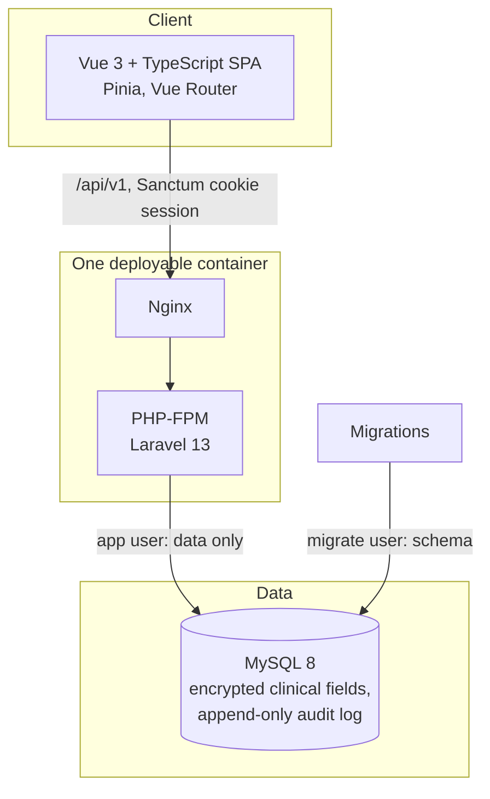
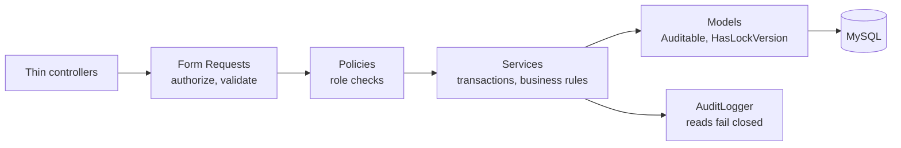
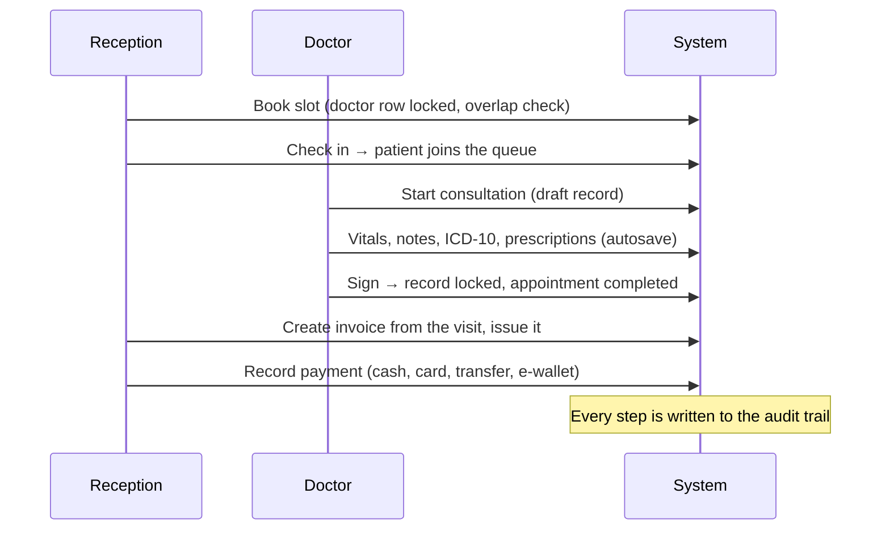
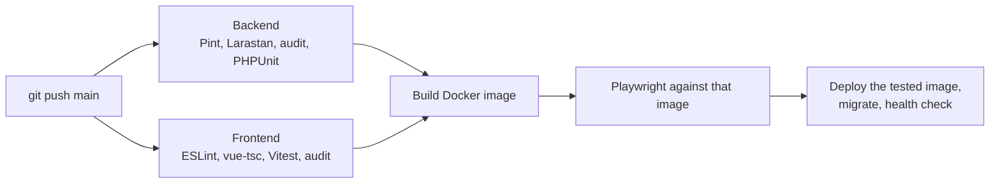

# Architecture

## System overview

```mermaid
flowchart TB
    subgraph Client
        SPA[Vue 3 + TypeScript SPA<br/>Pinia, Vue Router]
    end
    subgraph Server["One deployable container"]
        NG[Nginx]
        FPM[PHP-FPM<br/>Laravel 13]
    end
    subgraph Data
        DB[(MySQL 8<br/>encrypted clinical fields,<br/>append-only audit log)]
    end
    SPA -->|/api/v1, Sanctum cookie session| NG
    NG --> FPM
    FPM -->|app user: data only| DB
    MIG[Migrations] -->|migrate user: schema| DB
```

The API and the SPA share one origin, so cookie authentication needs no CORS.

## Backend layers

```mermaid
flowchart LR
    C[Thin controllers] --> R[Form Requests<br/>authorize, validate]
    R --> PO[Policies<br/>role checks]
    PO --> S[Services<br/>transactions, business rules]
    S --> M[Models<br/>Auditable, HasLockVersion]
    M --> DB[(MySQL)]
    S --> A[AuditLogger<br/>reads fail closed]
```

## A visit, from booking to payment

```mermaid
sequenceDiagram
    participant R as Reception
    participant D as Doctor
    participant S as System
    R->>S: Book slot (doctor row locked, overlap check)
    R->>S: Check in → patient joins the queue
    D->>S: Start consultation (draft record)
    D->>S: Vitals, notes, ICD-10, prescriptions (autosave)
    D->>S: Sign → record locked, appointment completed
    R->>S: Create invoice from the visit, issue it
    R->>S: Record payment (cash, card, transfer, e-wallet)
    Note over S: Every step is written to the audit trail
```

## Release pipeline

```mermaid
flowchart LR
    PUSH[git push main] --> BE[Backend<br/>Pint, Larastan, audit, PHPUnit]
    PUSH --> FE[Frontend<br/>ESLint, vue-tsc, Vitest, audit]
    BE & FE --> IMG[Build Docker image]
    IMG --> E2E[Playwright against that image]
    E2E --> DEP[Deploy the tested image,<br/>migrate, health check]
```
